# 🏗️ System Architecture Diagrams

## Quick Navigation
- [← Back to Architecture Overview](README.md)
- [DataOps Implementation](dataops-implementation.md) - Technical details
- [OpenBB Integration](openbb-integration.md) - Market data pipeline

## Overview

This document provides comprehensive visual diagrams illustrating the Church Asset Risk Dashboard architecture, data flows, and component interactions.

---

## 1. 🏛️ High-Level System Architecture

```mermaid
graph TB
    subgraph "Investment Committee Users"
        IC[👥 IC Members]
        Reports[📋 PDF Reports]
    end

    subgraph "Streamlit Dashboard Layer"
        UI[🖥️ Web Interface<br/>app.py]
        Cache[💾 Streamlit Cache]
    end

    subgraph "Core Engine Layer"
        Risk[⚡ Risk Engine<br/>risk_engine.py]
        Report[📄 Report Generator<br/>report_generator.py] 
        DataMgr[🔄 Enhanced Data Manager<br/>enhanced_data_sources.py]
    end

    subgraph "Data Storage Layer"
        AssetMgr[🗃️ Asset Data Manager<br/>asset_data_manager.py]
        Portfolio[📊 Portfolio Data<br/>portfolio.csv]
        
        subgraph "Asset-Based Cache"
            Rates[💰 Singapore Rates]
            Indices[📈 Market Indices]
            Currency[💱 Exchange Rates]
            Bonds[🏛️ Government Bonds]
            Current[⚡ Hot Cache]
        end
    end

    subgraph "External Services"
        OpenBB[🌐 OpenBB Platform<br/>100+ Data Providers]
        GitHub[🤖 GitHub Actions<br/>Automated Updates]
    end

    %% User Interactions
    IC --> UI
    UI --> Reports
    
    %% Core Processing
    UI --> Risk
    UI --> Report
    UI --> DataMgr
    Risk --> Portfolio
    
    %% Data Management
    DataMgr --> AssetMgr
    AssetMgr --> Rates
    AssetMgr --> Indices
    AssetMgr --> Currency
    AssetMgr --> Bonds
    AssetMgr --> Current
    
    %% External Integrations
    DataMgr --> OpenBB
    GitHub --> AssetMgr
    OpenBB --> GitHub
    
    %% Caching
    UI --> Cache
    DataMgr --> Cache

    classDef userLayer fill:#e1f5fe
    classDef uiLayer fill:#f3e5f5
    classDef coreLayer fill:#e8f5e8
    classDef dataLayer fill:#fff3e0
    classDef externalLayer fill:#fce4ec
    
    class IC,Reports userLayer
    class UI,Cache uiLayer
    class Risk,Report,DataMgr coreLayer
    class AssetMgr,Portfolio,Rates,Indices,Currency,Bonds,Current dataLayer
    class OpenBB,GitHub externalLayer
```

**Key Architecture Principles:**
- **Separation of Concerns**: UI, business logic, and data layers clearly separated
- **Performance**: Asset-based storage with hot cache for sub-second response
- **Reliability**: Multi-layer fallback (OpenBB → Cache → Mock data)
- **Automation**: GitHub Actions for hands-free data operations

---

## 2. 🔄 Data Flow Diagram - Market Data Pipeline

```mermaid
sequenceDiagram
    participant GHA as 🤖 GitHub Actions
    participant EDM as 🔄 Enhanced Data Manager
    participant OBB as 🌐 OpenBB Platform
    participant ADM as 🗃️ Asset Data Manager
    participant Cache as 💾 Asset Cache
    participant UI as 🖥️ Streamlit Dashboard
    participant IC as 👥 IC Members

    Note over GHA,IC: Daily Market Data Update Cycle (6 PM Singapore)
    
    GHA->>EDM: Trigger incremental update
    
    alt Fresh Data Needed
        EDM->>OBB: Fetch current prices
        OBB-->>EDM: STI, MSCI, Currency rates
        EDM->>OBB: Fetch Singapore rates
        OBB-->>EDM: SORA, FD rates, Gov bonds
    else Cached Data Available
        EDM->>Cache: Load existing data
    end
    
    EDM->>ADM: Save asset-specific files
    ADM->>Cache: Update rates/indices/currencies/bonds/{date}.json
    ADM->>Cache: Update current/hot_cache.json
    ADM->>Cache: Update metadata/status.json
    
    Note over EDM,ADM: Data Validation & Quality Checks
    EDM->>EDM: Validate completeness (99.64% target)
    EDM->>EDM: Check freshness (<48 hours)
    EDM->>EDM: Verify price integrity
    
    GHA->>GHA: Commit updated data files
    GHA->>GHA: Trigger Streamlit deployment
    
    Note over UI,IC: User Access - Real-time Dashboard
    IC->>UI: Access dashboard
    UI->>EDM: Request market data
    EDM->>ADM: Get current market data
    ADM->>Cache: Load from hot cache (0.002s)
    Cache-->>ADM: Singapore rates, indices, currency
    ADM-->>EDM: Aggregated market data
    EDM-->>UI: Formatted data for display
    UI-->>IC: Live dashboard with real market data
```

**Data Pipeline Features:**
- **Incremental Updates**: Daily current price updates (3 seconds)
- **Full Refresh**: Weekly historical data updates (30 seconds)
- **Hot Cache**: 0.002 second access time for dashboard
- **Quality Assurance**: Multi-stage validation and integrity checks

---

## 3. 🎯 User Journey Flowchart - Investment Committee Workflow

```mermaid
flowchart TD
    Start[👥 IC Member Accesses Dashboard] --> Load{🔄 Load Dashboard}
    
    Load --> DataCheck{📊 Market Data Available?}
    DataCheck -->|Yes| Dashboard[🖥️ Interactive Dashboard Loaded]
    DataCheck -->|No| Fallback[⚠️ Use Cached/Mock Data]
    Fallback --> Dashboard
    
    Dashboard --> Portfolio{📋 Review Portfolio}
    Portfolio --> Current[📊 Current Portfolio: SGD 3.4M]
    Current --> Scenarios[🎛️ Select Stress Scenario]
    
    Scenarios --> Preset{📋 Scenario Type?}
    Preset -->|Preset| QuickTest[⚡ Conservative/Moderate/Severe]
    Preset -->|Custom| CustomParams[🔧 Adjust Parameters]
    
    QuickTest --> Calculate[⚡ Calculate Risk Metrics]
    CustomParams --> Params[🎚️ Interest Rate Shock<br/>📈 Inflation Spike<br/>📉 Asset Drawdown<br/>🔒 Liquidity Freeze]
    Params --> Calculate
    
    Calculate --> Results[📊 Display Results]
    Results --> Metrics[📈 Key Metrics:<br/>• Portfolio Value Under Stress<br/>• Reserve Coverage Ratio<br/>• Maximum Drawdown<br/>• Time to Liquidity<br/>• Risk Breach Flags]
    
    Metrics --> Analysis{🔍 Analysis Satisfactory?}
    Analysis -->|No| Scenarios
    Analysis -->|Yes| Charts[📊 View Charts & Analytics]
    
    Charts --> Options{📋 Next Action?}
    Options -->|More Scenarios| Scenarios
    Options -->|Edit Portfolio| EditPortfolio[📝 Edit Portfolio Data]
    Options -->|Generate Report| Report[📄 Generate PDF Report]
    Options -->|Done| End[✅ Session Complete]
    
    EditPortfolio --> Save[💾 Save Portfolio Changes]
    Save --> Dashboard
    
    Report --> PDF[📋 CPC_StressTest_2025-07-26_14-30.pdf]
    PDF --> Download[⬇️ Download for IC Meeting]
    Download --> End
    
    %% Styling
    classDef startEnd fill:#e1f5fe,stroke:#01579b,stroke-width:2px
    classDef process fill:#e8f5e8,stroke:#2e7d32,stroke-width:2px
    classDef decision fill:#fff3e0,stroke:#ef6c00,stroke-width:2px
    classDef data fill:#f3e5f5,stroke:#7b1fa2,stroke-width:2px
    classDef output fill:#fce4ec,stroke:#c2185b,stroke-width:2px
    
    class Start,End startEnd
    class Load,Dashboard,Calculate,Results,Charts,EditPortfolio,Save,Report,PDF,Download process
    class DataCheck,Portfolio,Preset,Analysis,Options decision
    class Current,Params,Metrics data
    class QuickTest,CustomParams,Fallback output
```

**User Journey Insights:**
- **Quick Access**: Dashboard loads in <1 second with hot cache
- **Flexible Analysis**: Both preset and custom stress scenarios
- **Interactive Exploration**: Real-time parameter adjustment with immediate feedback
- **Professional Output**: Timestamped PDF reports ready for IC meetings

---

## 4. 🔧 Component Interaction Diagram - Core Engine

```mermaid
graph LR
    subgraph "Frontend Layer"
        App[app.py<br/>🖥️ Streamlit Interface]
        Cache[Streamlit Cache<br/>💾 Session State]
    end
    
    subgraph "Business Logic Layer"
        Risk[risk_engine.py<br/>⚡ RiskEngine Class]
        Report[report_generator.py<br/>📄 ReportGenerator]
        Config[config.py<br/>⚙️ Configuration]
    end
    
    subgraph "Data Management Layer"
        EDM[enhanced_data_sources.py<br/>🔄 EnhancedDataSourceManager]
        ADM[asset_data_manager.py<br/>🗃️ AssetDataManager]
    end
    
    subgraph "Data Sources"
        Portfolio[portfolio.csv<br/>📊 Investment Data]
        Market[Market Cache<br/>💰 Real-time Data]
        OpenBB[OpenBB Platform<br/>🌐 External API]
    end
    
    %% Frontend Interactions
    App --> Risk
    App --> Report
    App --> EDM
    App --> Portfolio
    App <--> Cache
    
    %% Business Logic Interactions
    Risk --> Config
    Risk --> Portfolio
    Report --> Config
    
    %% Data Management Interactions  
    EDM --> ADM
    EDM --> OpenBB
    EDM --> Market
    ADM --> Market
    
    %% Data Flow Labels
    App -.->|"User Parameters"| Risk
    Risk -.->|"Stress Metrics"| App
    App -.->|"Market Data Request"| EDM
    EDM -.->|"Formatted Data"| App
    Risk -.->|"Portfolio Analysis"| Report
    Report -.->|"PDF Buffer"| App

    classDef frontend fill:#e1f5fe
    classDef business fill:#e8f5e8  
    classDef data fill:#fff3e0
    classDef external fill:#fce4ec
    
    class App,Cache frontend
    class Risk,Report,Config business
    class EDM,ADM data
    class Portfolio,Market,OpenBB external
```

**Component Responsibilities:**
- **Frontend**: User interface, caching, parameter collection
- **Business Logic**: Risk calculations, report generation, configuration
- **Data Management**: Market data fetching, asset storage, cache management
- **External**: Portfolio data, market APIs, file storage

---

## 5. ⚡ Performance Architecture - Asset-Based Storage

```mermaid
graph TB
    subgraph "Legacy System (Phase 1)"
        LegacyApp[Streamlit App] --> LegacyData[Single JSON File<br/>📁 22,553 lines<br/>⏱️ 2+ seconds load]
        LegacyData --> LegacyAPI[yfinance + MAS API<br/>🔄 Every request]
    end
    
    subgraph "Enhanced System (Phase 2+)"
        App[Streamlit App] --> HotCache[Hot Cache<br/>📁 current/*.json<br/>⚡ 0.002 seconds]
        
        HotCache --> AssetFiles[Asset-Specific Files]
        AssetFiles --> Rates[rates/singapore_rates_2025-07.json<br/>📊 ~100 lines]
        AssetFiles --> Indices[indices/STI_2025-07.json<br/>📈 ~500 lines]  
        AssetFiles --> Currency[currencies/SGDUSD_2025-07.json<br/>💱 ~50 lines]
        AssetFiles --> Bonds[bonds/singapore_bonds_2025-07.json<br/>🏛️ ~80 lines]
        
        App --> Enhanced[Enhanced Data Manager<br/>🔄 Intelligent Refresh]
        Enhanced --> OpenBB[OpenBB Platform<br/>🌐 100+ Providers]
        Enhanced --> GitHub[GitHub Actions<br/>🤖 Automated Updates]
        
        GitHub -.->|"Daily 6PM SGT"| AssetFiles
        OpenBB -.->|"Real Market Data"| Enhanced
    end
    
    %% Performance Metrics
    LegacyApp -.->|"❌ Slow"| LegacyData
    App -.->|"✅ 1000x Faster"| HotCache
    
    subgraph "Performance Comparison"
        Metrics[📊 Performance Metrics<br/>━━━━━━━━━━━━━━━━━━━━<br/>Load Time: 2s → 0.002s<br/>Memory: 90% reduction<br/>Maintainability: Asset isolation<br/>Reliability: Multi-layer fallback]
    end

    classDef legacy fill:#ffebee,stroke:#c62828
    classDef enhanced fill:#e8f5e8,stroke:#2e7d32
    classDef performance fill:#e1f5fe,stroke:#01579b
    
    class LegacyApp,LegacyData,LegacyAPI legacy
    class App,HotCache,AssetFiles,Rates,Indices,Currency,Bonds,Enhanced,OpenBB,GitHub enhanced
    class Metrics performance
```

**Performance Improvements:**
- **1000x Load Speed**: 2+ seconds → 0.002 seconds
- **Modular Storage**: Asset-specific files vs monolithic JSON
- **Smart Caching**: Hot cache for immediate dashboard access
- **Automated Updates**: Background refresh without user impact

---

## 6. 🛡️ Reliability & Fallback Architecture

```mermaid
graph TD
    Request[📊 Market Data Request] --> Primary{🌐 OpenBB Platform Available?}
    
    Primary -->|✅ Available| Fresh[🔄 Fetch Fresh Data]
    Primary -->|❌ Unavailable| Cache{💾 Cache Available?}
    
    Fresh --> Validate{✅ Data Valid?}
    Validate -->|✅ Valid| Save[💾 Save to Asset Cache]
    Validate -->|❌ Invalid| Cache
    
    Cache -->|✅ Available| Cached[📁 Load Cached Data]
    Cache -->|❌ Empty| Mock[🎭 Load Mock Data]
    
    Save --> Current[⚡ Update Hot Cache]
    Cached --> Age{⏰ Data Fresh?}
    Age -->|✅ <48 hours| Current
    Age -->|❌ Stale| Warn[⚠️ Show Staleness Warning]
    
    Mock --> Warn2[⚠️ Show Mock Data Warning]
    
    Current --> Dashboard[🖥️ Display in Dashboard]
    Warn --> Dashboard
    Warn2 --> Dashboard
    
    %% Error Handling
    Fresh -.->|"API Error"| Log[📝 Log Error]
    Validate -.->|"Data Error"| Log
    Cache -.->|"File Error"| Log
    
    Log --> Fallback[🔄 Trigger Fallback]
    Fallback --> Cache

    classDef primary fill:#e8f5e8,stroke:#2e7d32
    classDef fallback fill:#fff3e0,stroke:#ef6c00  
    classDef error fill:#ffebee,stroke:#c62828
    classDef success fill:#e1f5fe,stroke:#01579b
    
    class Request,Primary,Fresh,Validate,Save primary
    class Cache,Cached,Age,Mock fallback
    class Log,Fallback,Warn,Warn2 error
    class Current,Dashboard success
```

**Reliability Features:**
- **Triple Fallback**: OpenBB → Cache → Mock data
- **Data Validation**: Quality checks at multiple stages
- **Graceful Degradation**: System never fails, always provides data
- **User Transparency**: Clear warnings when using fallback data

---

## 📊 Diagram Summary

The architecture diagrams reveal a **production-grade system** designed for:

### **Scalability**
- Modular asset-based storage
- Component separation for independent scaling
- Automated data operations

### **Performance** 
- 1000x improvement through asset-based caching
- Hot cache for sub-second dashboard loading
- Efficient memory usage patterns

### **Reliability**
- Multi-layer fallback mechanisms
- Comprehensive error handling
- Automated monitoring and recovery

### **User Experience**
- Intuitive dashboard workflow
- Real-time parameter adjustment
- Professional report generation

## 🔗 Related Documentation

- [🏗️ Architecture Overview](README.md) - Back to main architecture section
- [📊 DataOps Implementation](dataops-implementation.md) - Technical implementation details
- [🌐 OpenBB Integration](openbb-integration.md) - Market data pipeline specifics
- [🛠️ Development Guide](../development/) - API reference and deployment procedures

---

*These diagrams provide visual representation of the system architecture described in the technical documentation. For implementation details, refer to the specific documentation sections linked above.*